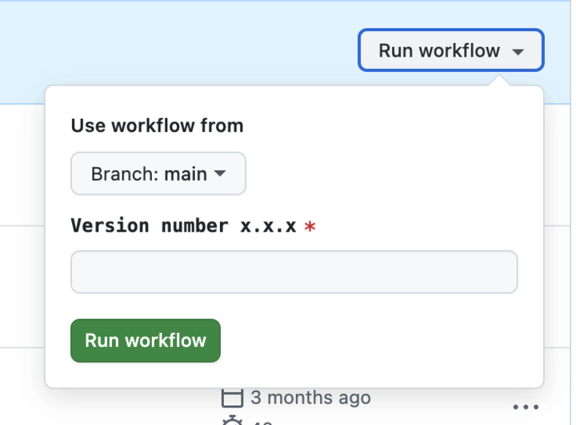

# Ledger Iframe Bridge

This repository hosts the Ledger iframe bridge, which is deployed on GitHub Pages.

## Deployment Process

Deployment is managed through a GitHub Actions workflow. Follow these steps to deploy a new version:

1. Merge your branch into `main`.
2. Navigate to the [deployment workflow](https://github.com/MetaMask/ledger-iframe-bridge/actions/workflows/static.yml).
3. Specify a new version and trigger the workflow.

You can also deploy directly from a branch without merging into `main`.



---
⚠ **Warning:**
- There is no folder protection. If you specify an [existing folder name](https://github.com/MetaMask/ledger-iframe-bridge/tree/gh-pages), it will be overwritten.
- There isn't any naming restriction. The only requirement is that value must not be empty.

## After Deployment

- Once the workflow completes, a new folder will be created in the [`gh-pages` branch](https://github.com/MetaMask/ledger-iframe-bridge/tree/gh-pages).
- The deployed version will be available at:
  ```
  https://metamask.github.io/ledger-iframe-bridge/your-version/
  ```

